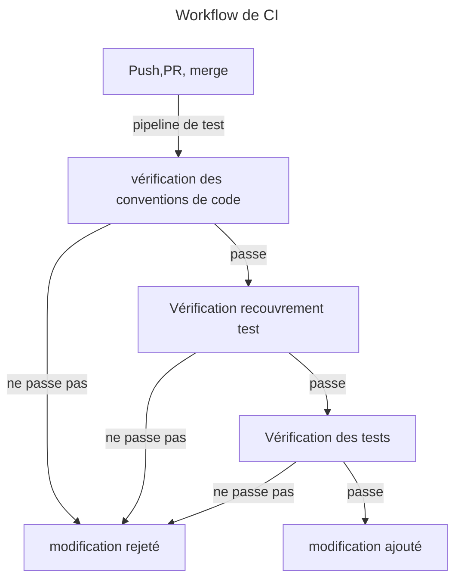
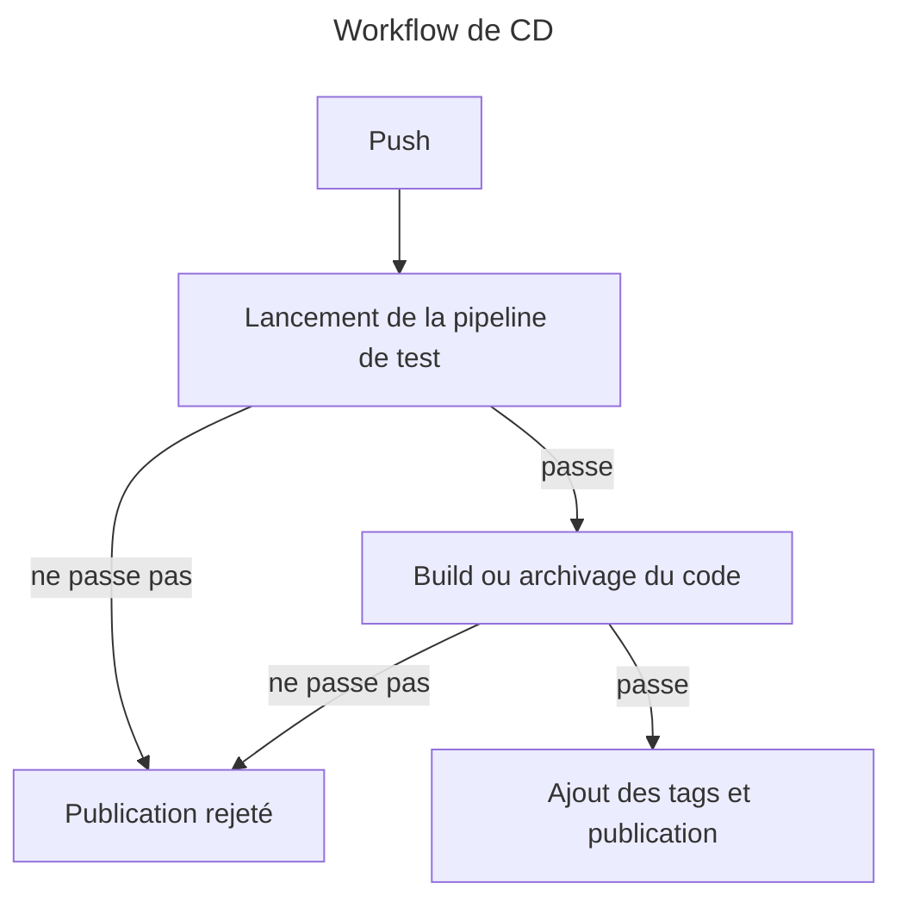

# Les workflows indspensables à un bon projet

Ce dossier contient selon chaque langage des workflows de CI et CD. 

## Définition

CI: Intégration en Continue d'un projet. Cela consiste à la vérification de tout changement apporter au projet

CD: Déployement en Continue d'un projet. Consiste à intégrer et vérifier les derniers changement dans l'optique de les publier.

## Description des workflows de CI

Voici le workflow des templates de CI proposé dans ce projet. Elle se déclanche au push merge et pull request sur les branchs main, dev et hotfix.

## Description des workflows de CD

Voici le workflow des templates de CD proposé dans ce projet. Elle se déclanche au push merge et pull request sur la branche main et dev. 

Sur une branch main publication d'une version de production.
Sur une branch dev publication d'une version de développement.

## Comment adapter ces workflows à mon projet

Vous pouvez suivre ces étapes génériques pour adapter les templates à votre projet. Vérifier quand même que cela répond à votre besoin.

-> Rechercher dans l'ensembles des fichiers yml de ce dossier le mot clefs *template* et le remplacer par le *nom de votre projet*.
-> Vérifier les versions utiliser pour être en accord avec celles de votre projet 

Pour plus d'information sur les actions vous pouvez consulter la documentation GitHub qui suit : https://docs.github.com/fr/actions